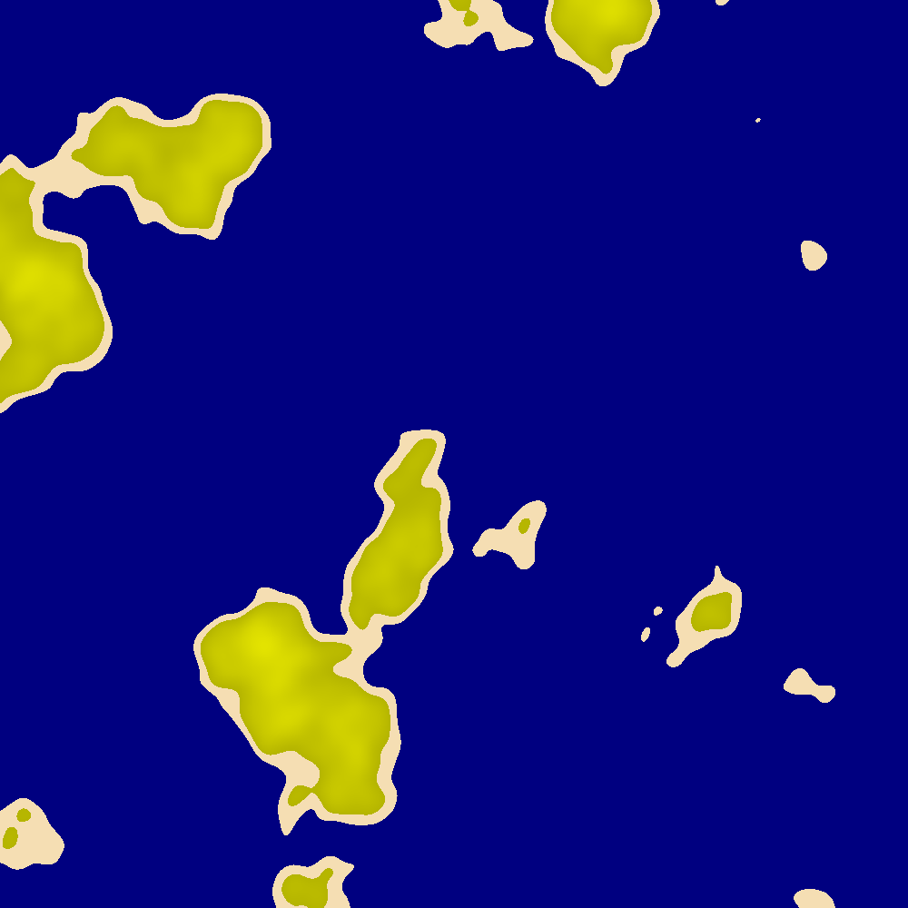
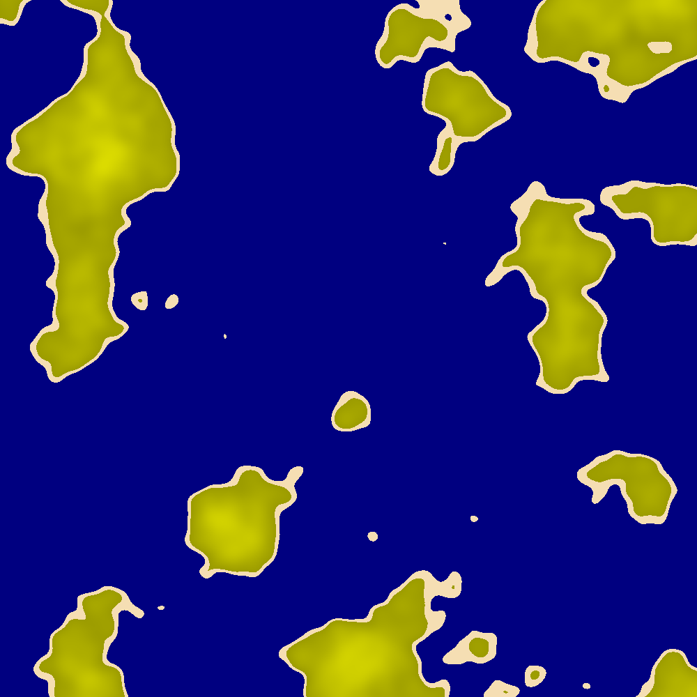
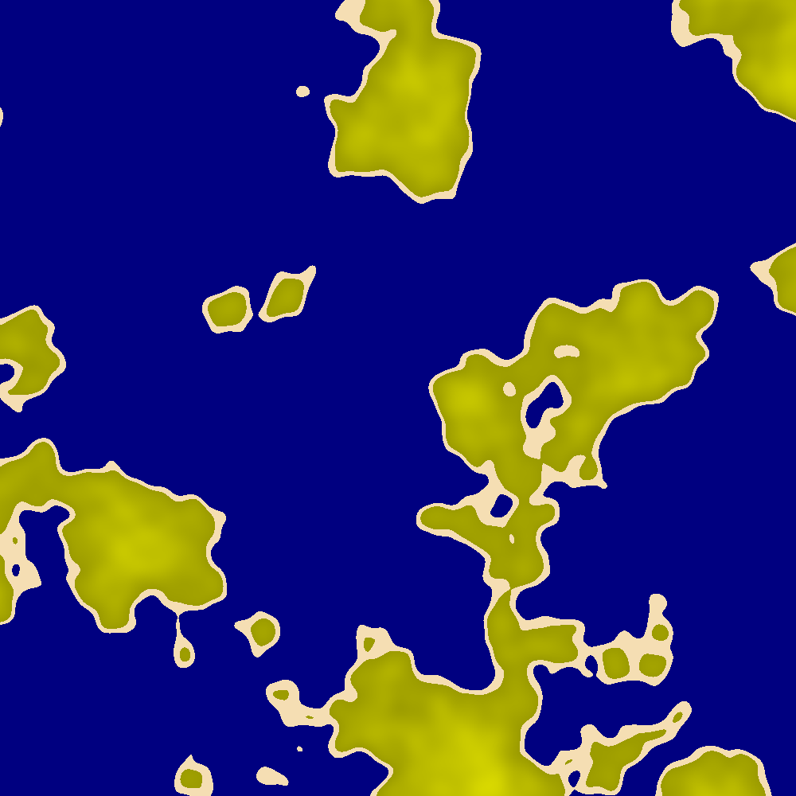
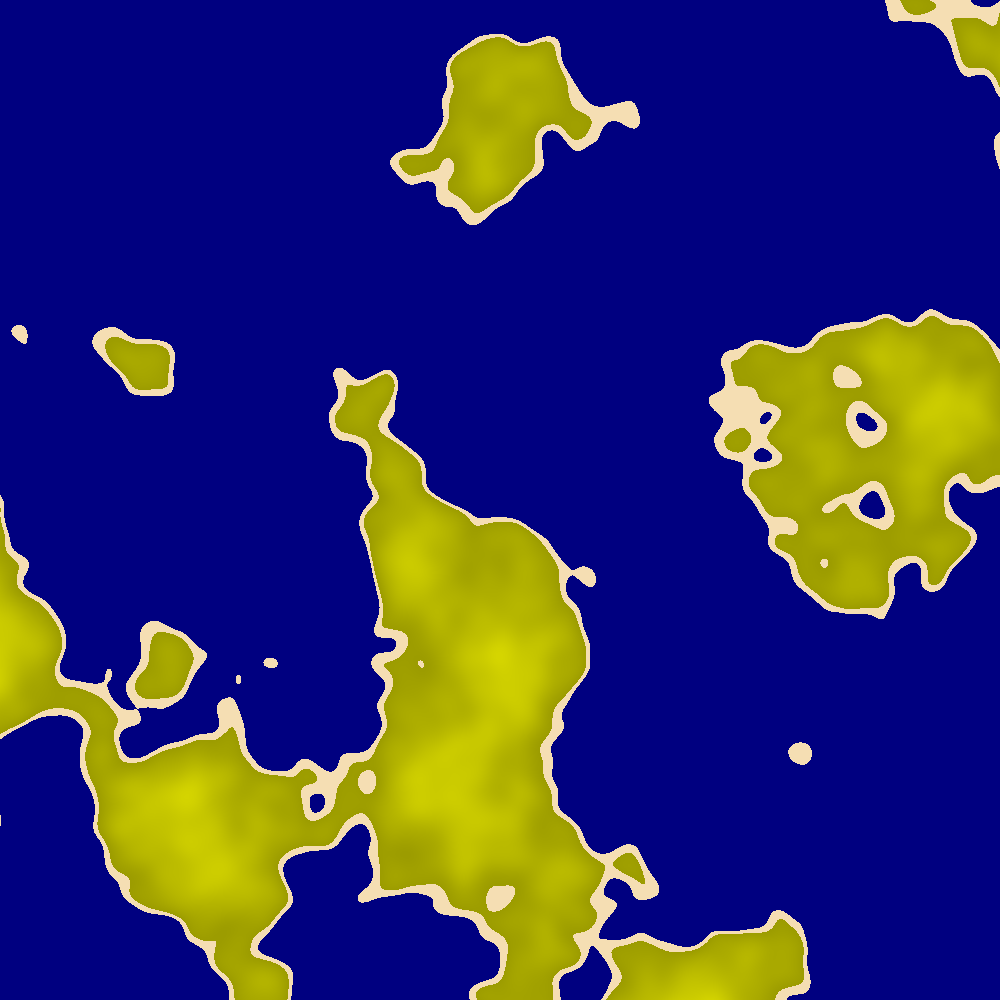

# Pygenesis

2D Terrain Generation (work in progress...).

TODO:

1. remove noise.snoise3 dependancy and implement different kind of noise
2. introduce more biomes (with a better method than the currently implemented one)
3. better seed generation once Perlin Noise is removed
4. randomly spawn entities around maps?

Here are some examples of the maps that are generated with the current implementation:

